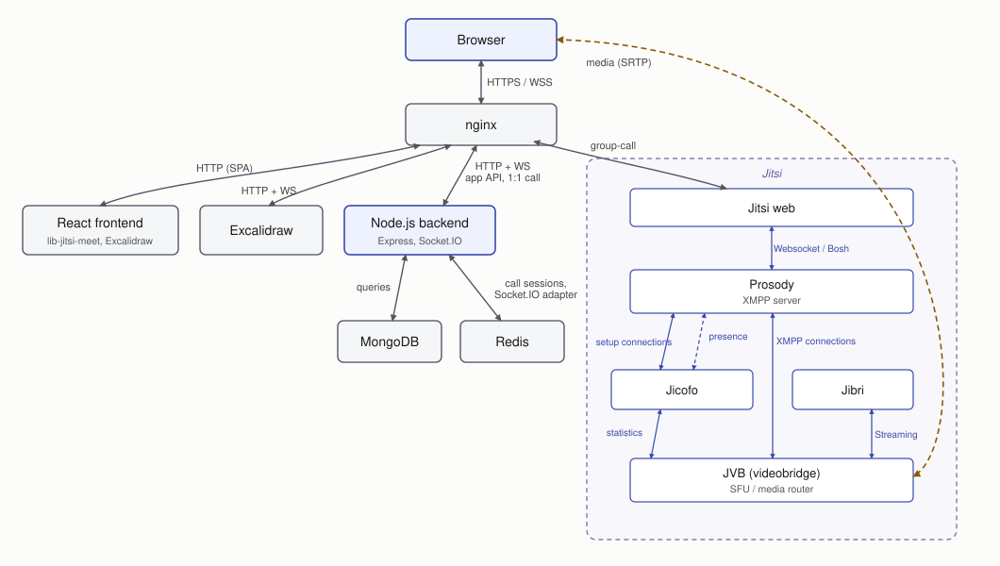

WebRTC collaboration platform.

**Live:** https://one-chat.eu

## Architecture

## Also includes

- Conversations
- Video and audio calls
- Collaborative whiteboard
- User accounts and profiles
- Call recording

## Tech

- **Frontend:** React, Redux, TypeScript
- **Backend:** Node.js, Express
- **Real-time / media:** WebRTC, Socket.IO, Jitsi, Excalidraw
- **Data:** MongoDB, Redis
- **DevOps:** Docker, Nginx, GitHub Actions
- **Observability:** OpenTelemetry, Prometheus, Grafana
- **Testing:** Jest, Playwright
